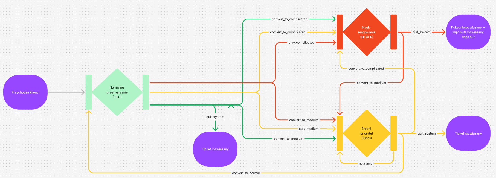
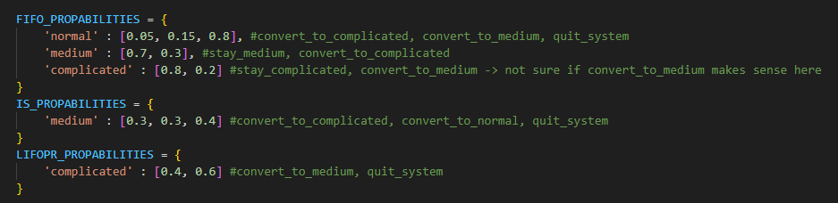

## Temat projektu

Projekt dotyczący symulacji działania call center, złożone z kilku placówek, utworzonego na bazie sieci kolejkowych.

## Pobranie repozytorium

```
git clone https://github.com/michalsciubisz/sieci_kolejkowe_bcmp.git
```

## Instalacja wymaganych bibliotek

```
pip install requirements.txt
```

## Obecnie system prezentuje się następująco:



Nazwy na gałęziach łączacych odpowiadają nazwą umieszczonym w komentarzach (w pliku simulation.py) tak jak podano poniżej:



Wszelkie wartości do zmiany działania symulacji powinny zostać umieszczone na początku pliku simulations.py